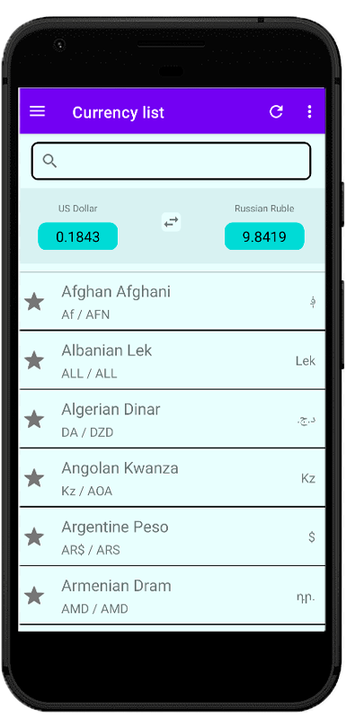
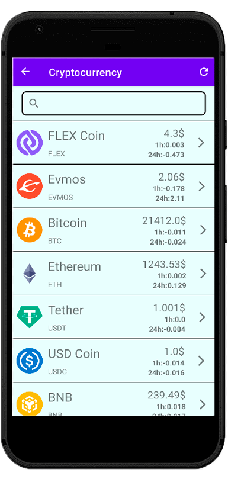
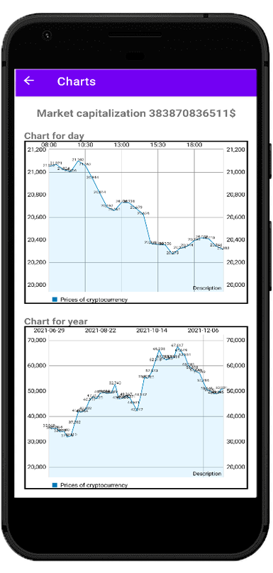
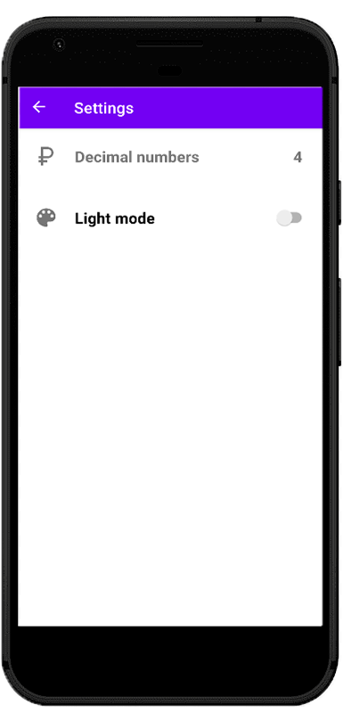
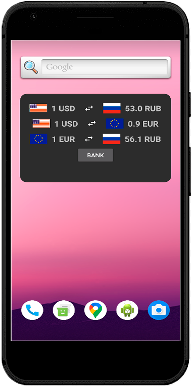

# Currency-Converter
## Introduction
Today, people carefully monitor the exchange rate in order to buy or sell this or that currency on time.
Also, many have become involved in cryptocurrencies, they also follow the graphs of their growth and fall.
There are many applications that do only one of these functions, either monitor the currency or the cryptocurrency.
The Currency Converter application combines these functions together to be useful to everyone.

---
## Preview

---
## Technologies that was used
### Main
- [MVVM](https://en.wikipedia.org/wiki/Model%E2%80%93view%E2%80%93viewmodel) and [LiveData](https://developer.android.com/topic/libraries/architecture/livedata) (Model View ViewModel pattern)
- [Koin](https://insert-koin.io/) (Dependency injection)
- [Room](https://developer.android.com/training/data-storage/room) (Database)
- [Coroutines](https://kotlinlang.org/docs/coroutines-overview.html) (Asynchronous programming and threads)
- [Retrofit](https://square.github.io/retrofit/) (Networking)
### Others
- [Navigation Graph](https://developer.android.com/reference/androidx/navigation/NavGraph) (Navigation between fragments)
- [Charts](https://github.com/PhilJay/MPAndroidChart)

---
## Downlods
The latest release and pre-release versions are [available on GitHub](https://github.com/KrasavaStep/Currency-Converter/releases).

Or to save a click, [this link](https://github.com/KrasavaStep/Currency-Converter/releases/tag/v1.0.0) should always point to the most recent release.

---
## License
### MIT License

Copyright (c) 2022 [Stepan](https://github.com/KrasavaStep)

Permission is hereby granted, free of charge, to any person obtaining a copy
of this software and associated documentation files (the "Software"), to deal
in the Software without restriction, including without limitation the rights
to use, copy, modify, merge, publish, distribute, sublicense, and/or sell
copies of the Software, and to permit persons to whom the Software is
furnished to do so, subject to the following conditions:

The above copyright notice and this permission notice shall be included in all
copies or substantial portions of the Software.

THE SOFTWARE IS PROVIDED "AS IS", WITHOUT WARRANTY OF ANY KIND, EXPRESS OR
IMPLIED, INCLUDING BUT NOT LIMITED TO THE WARRANTIES OF MERCHANTABILITY,
FITNESS FOR A PARTICULAR PURPOSE AND NONINFRINGEMENT. IN NO EVENT SHALL THE
AUTHORS OR COPYRIGHT HOLDERS BE LIABLE FOR ANY CLAIM, DAMAGES OR OTHER
LIABILITY, WHETHER IN AN ACTION OF CONTRACT, TORT OR OTHERWISE, ARISING FROM,
OUT OF OR IN CONNECTION WITH THE SOFTWARE OR THE USE OR OTHER DEALINGS IN THE
SOFTWARE.
